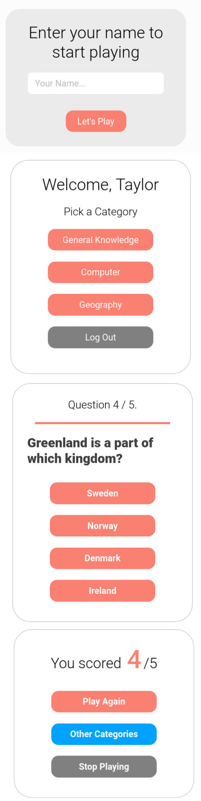

## DESCRIPTION:
- A Trivia / quiz app, made with React.
- Version 2.
- [Youtube Video of the App](https://youtu.be/nE3mAab5-2U)

## OUTCOME:
### VERSION 1 (branch: main)
- status: 100% 
- React Quiz App, 
    - with 1 category
    - data fetched from a JSON API.
- link to the App's video on youtube: https://youtu.be/J_h2WUWCQFc
### VERSION 2 (branch: version2) 
- status: 100%.
- React Quiz App, 
    + with 3 categories
    - data fetched from a JSON API.
- link to the App's video on youtube: https://youtu.be/nE3mAab5-2U
### VERSION 3 (branch: version3) 
- status: pending.
- React Quiz App, 
    + with add categories + add questions + answers features.
    - with 3 categories
    - data fetched from a JSON API.
- link to the App's video on youtube: https://

## TECH STACKS:
- React,
- React-router-dom, react-icons,
- Hooks: useState, useEffect,
- styling: Styled Components.

## PROGRESS:
- Done: 100%.

## How to run
`yarn install`
`yarn start`
### To Run JSON server:
`npx json-server --watch data/db.json --port 8000`

## View other projects:
- [My Pinterest](https://pin.it/16vGwjy)
- [My Youtube Channel](https://www.youtube.com/channel/UCfkbnM9WvHD3mjecBiGHCBQ/playlists)

## IMAGE:
