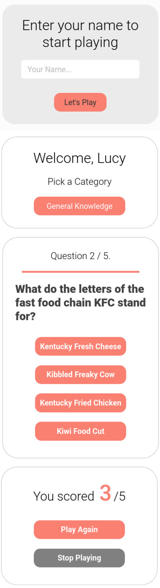

## DESCRIPTION:
- A Trivia / quiz app, made with React.
- [Youtube Video of the App](https://youtu.be/J_h2WUWCQFc)

## OUTCOME:
### VERSION 1 (branch: main)
- React Quiz App, data fetched from a JSON API.
- link to the App's video on youtube: https://youtu.be/J_h2WUWCQFc
### VERSION 2 (branch: version1) 
- Status: pending.
- React Quiz App, with more categories & data fetched from Rapid API.

## TECH STACKS:
- React,
- React-router-dom, react-icons,
- Hooks: useState, useEffect,
- styling: Styled Components.

## PROGRESS:
- Done: 

## How to run
`yarn install`
`yarn start`
### To Run JSON server:
`npx json-server --watch data/db.json --port 8000`

## View other projects:
- [My Pinterest](https://pin.it/16vGwjy)
- [My Youtube Channel](https://www.youtube.com/channel/UCfkbnM9WvHD3mjecBiGHCBQ/playlists)

## IMAGE:
